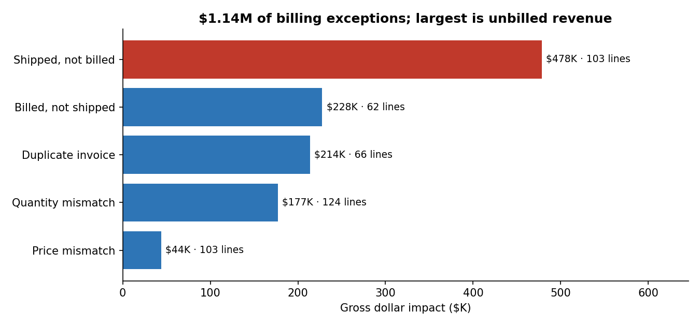

# Project 2: Automated Order-to-Bill Reconciliation

It checks that everything shipped was billed correctly. It caught 99% of planted billing errors and flagged $1.14M in impact; the biggest problem was $478K shipped but never billed.

**Python (pandas) · Excel**

## Business problem
Reconciling orders, shipments, and invoices is often manual. Errors slip through as **over-billing disputes** with customers or **unbilled revenue** that Finance never sees.

## What I built
A Python script that reconciles every order line and produces an exception report:
1. **Data-quality checks first:** row counts, duplicate keys, nulls.
2. **Aggregates shipments and invoices to order-line level before joining**, so partial shipments and multiple invoices aren't double-counted.
3. **Full outer join** so records missing on either side (billed but never shipped, shipped but never billed) surface.
4. **Classifies five error types**, calculates the dollar variance (over- or under-billed), and assigns an owner team.
5. A **7-day billing-lag rule** so recent shipments that simply haven't been invoiced yet aren't flagged.

## Results

- Detected **99.1% of the injected billing errors with 98.3% precision** (450 of 454 found; 458 lines flagged).
- **$1.14M gross dollar impact** across 458 exception lines.
- The largest category is **shipped but not billed: $478K on 103 lines**, which is revenue leakage.

| Error type | Lines | Gross impact | Owner |

| Shipped, not billed | 103 | $478K | Billing Ops |
| Billed, not shipped | 62 | $228K | Billing Ops |
| Duplicate invoice | 66 | $214K | Billing Ops |
| Quantity mismatch | 124 | $177K | Logistics / Billing |
| Price mismatch | 103 | $44K | Pricing / Contracts |

## Recommendation
Billing Ops should work the shipped-not-billed list first (unrecognized revenue), then duplicates and billed-not-shipped (customer dispute risk).

## Files
| File | What it does |
|---|---|
| [`reconcile.py`](reconcile.py) | The reconciliation |
| [`billing_exceptions.xlsx`](billing_exceptions.xlsx) | Output: Summary, Exceptions (one row per issue, sorted by $), Data Quality |

## How to run
`python reconcile.py` (reads `../data`, writes `billing_exceptions.xlsx`)
