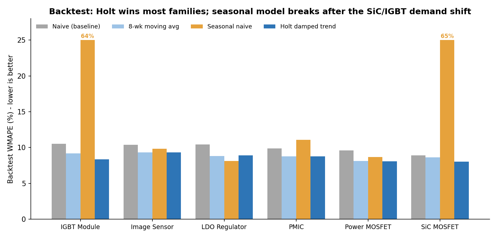
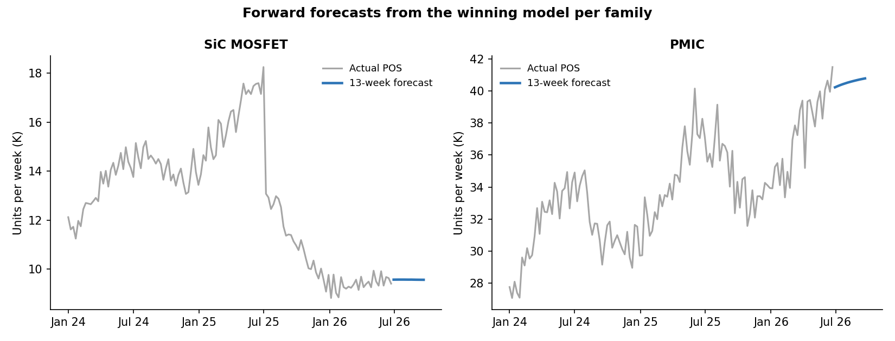

# Project 3: Sell-Through Demand Forecasting

It tests four forecasting methods on past sales and picks the most accurate one per product family.
**Error dropped from 10% to 8.3%**

**Python (pandas, statsmodels) · Excel**

## Business problem
Planning needs reliable forecasts of **end-customer demand** (distributor sell-through) to avoid stockouts and excess inventory. The question isn't just "what's the forecast," but **which method can we trust, per product family?**

## What I built
- Weekly sell-through for each of 42 parts (summed across distributors).
- Four candidate models: **naive** (baseline), **8-week moving average**, **seasonal naive**, and **Holt damped-trend exponential smoothing**.
- A **rolling-origin backtest**: 6 cut-off points, forecasting 13 weeks ahead each time, never training on future data.
- Scored with **WMAPE** (volume-weighted error) and **bias** (over- vs under-forecasting); picked the best model per family and produced a 13-week forward forecast.

## Results

- Overall forecast error improved from **10.0% (naive baseline) to 8.3%**, a **17% reduction**.
- Holt damped-trend wins 5 of 6 families; seasonal naive wins LDO Regulators.
- **Seasonal naive failed badly on SiC and IGBT (~65% error)** because demand shifted in mid-2025, so last year's pattern no longer applied. That's exactly why methods should be chosen by backtest, not assumption.
- Growing families (PMIC, Image Sensor) show **about −6% bias**, meaning the models under-forecast growth.

## Recommendation
Use a different method per product family, and add leading indicators (bookings, design registrations) for the growth families where forecasts run low.

## Files
| File | What it does |

| [`forecast.py`](forecast.py) | Backtest, model selection, forward forecast |
| [`forecast_results.xlsx`](forecast_results.xlsx) | Model selection, WMAPE by model, 13-week forecast, history, backtest detail |

## How to run
`pip install statsmodels` then `python forecast.py`
