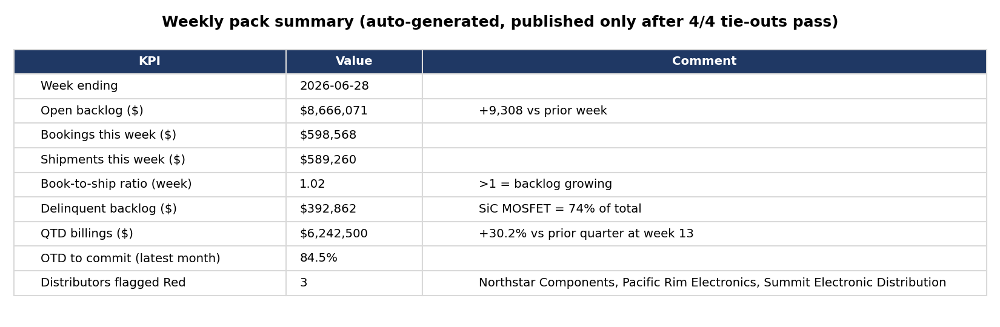
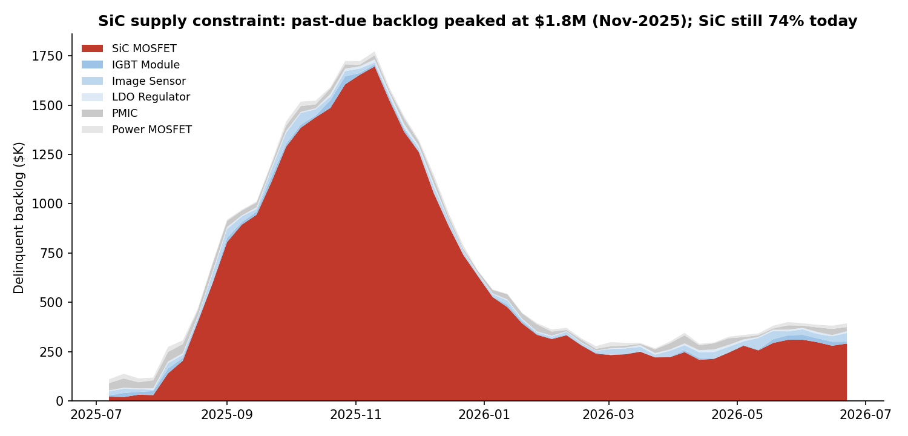
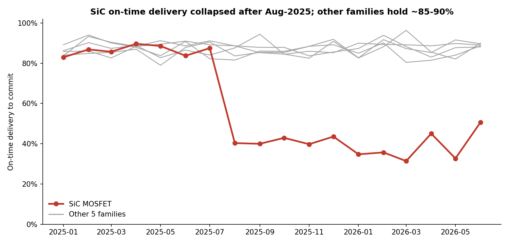
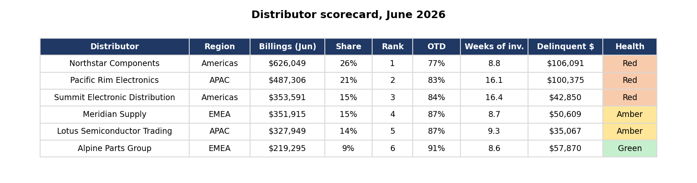

# Project 4: Weekly Distribution Ops Reporting Pack

**Snowflake SQL · Python · Excel · Requirements & documentation**

## Business problem
Distribution leadership reviews backlog, billing, and distributor performance every Monday. The numbers were assembled by hand from several systems and **didn't always match Finance**.

## What I built
1. **A requirements spec** ([requirements_spec.md](requirements_spec.md)) with agreed KPI definitions, business rules, acceptance criteria, a project plan, and a risk log, plus a [data dictionary](data_dictionary.md).
2. **Six SQL report views in Snowflake** ([01_report_views.sql](01_report_views.sql)):

   | Report | Answers | SQL technique |
  
   | Backlog waterfall | How did backlog move this week? (begin + bookings − shipments = end) | Date spine, opening balance, running totals |
   | Delinquency trend | How much is past due, where, and is it improving? | Interval join: "past due as of each week" |
   | QTD billings pace | Are we billing faster or slower than last quarter? | Week-of-quarter bucketing, LAG across quarters |
   | On-time delivery | Are we shipping on time vs commit and request dates? | Conditional aggregation |
   | Distributor scorecard | Which distributors are healthy? | Multi-metric join, RANK, rank change, health rules |
   | Tie-out checks | Do the reports reconcile to source? | Control totals |

3. **An automated Excel pack** ([build_report_pack.py](build_report_pack.py)) that runs the checks first and **refuses to publish if any tie-out fails**.

## Results

- **All 4 tie-out checks pass to the dollar** (e.g., waterfall ending backlog = current backlog = $8,666,071).
- Tested the gate by breaking the backlog logic on purpose: the check failed and the pack was not published.

- Past-due backlog **peaked at $1.8M in Nov-2025** during the SiC supply constraint, recovered to ~$250K, and has crept back to **$393K**, of which **SiC MOSFET is 74%**.

- **SiC on-time delivery fell from ~88% to 33–51%** after Aug-2025, while other families held ~85–90%.
- **Q2-2026 billings finished 30% ahead** of Q1 at the same point in the quarter.

- **3 distributors flagged Red:** Pacific Rim and Summit for ~16 weeks of inventory, Northstar for on-time delivery below 80%.

## Business message
Revenue is recovering, SiC supply is the delivery bottleneck, and three distributors need attention this week.

## Files
| File | What it does |

| [`requirements_spec.md`](requirements_spec.md) | Business need, KPI definitions, rules, acceptance criteria, plan, risks |
| [`data_dictionary.md`](data_dictionary.md) | Every report view: grain, key columns, purpose |
| [`01_report_views.sql`](01_report_views.sql) | The six report views + tie-out checks |
| [`build_report_pack.py`](build_report_pack.py) | Builds the formatted Excel pack (only if checks pass) |
| [`Distribution_Ops_Weekly_Pack_2026-06-22.xlsx`](Distribution_Ops_Weekly_Pack_2026-06-22.xlsx) | Sample output: Summary + 5 reports + tie-out checks |

## How to run
- **Snowflake:** run `01_report_views.sql` (after Project 1), then `python build_report_pack.py --snowflake` (set `SF_ACCOUNT`, `SF_USER`, `SF_PASSWORD` environment variables).
- **Local, no Snowflake:** `python build_report_pack.py --local`
