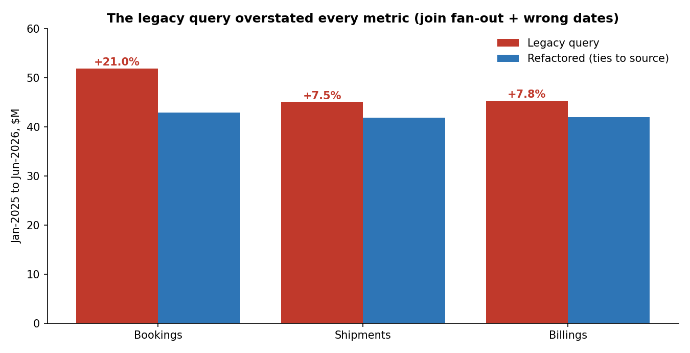

# Project 5: Fixing and Optimizing a Legacy Report Query

**SQL · Snowflake · Query Profile**

## Business problem
An inherited "Monthly Distributor Performance" query fed a leadership report. **Finance noticed its billings never matched their numbers.**

## What I did
1. Diagnosed the legacy query ([01_legacy_query.sql](01_legacy_query.sql)) and traced every difference to a root cause ([03_compare_and_explain.sql](03_compare_and_explain.sql)).
2. Rewrote it ([02_refactored_query.sql](02_refactored_query.sql)) so each metric is aggregated at its own grain, with its own date, before joining.
3. Proved the rewrite ties to the source billing table exactly.

## Results

| Metric (Jan-2025 to Jun-2026) | Legacy | Refactored | Legacy error |

| Bookings | $51.9M | $42.9M | **+21.0%** |
| Shipments | $45.1M | $41.9M | **+7.5%** |
| Billings | $45.3M | $42.0M | **+7.8%** (refactored ties to source exactly) |

- **Join fan-out:** 1,425 order lines with multiple shipments and invoices were multiplied into 5,576 rows.
- **Silently dropped data:** a WHERE filter removed **$8.7M of bookings on 2,057 open orders** not yet billed.
- **Fragility:** one blank row in the exclusion list made the legacy report **return zero rows**; the refactored version was unaffected.

## Changelog: bugs and fixes
| # | Bug | Impact | Fix |

| 1 | Joined orders → shipments → invoices at line level, then summed | Fan-out inflated every metric | Aggregate each metric at its own grain, then join |
| 2 | Every metric bucketed by invoice month | Bookings reported in the wrong month | Bookings by order date, shipments by ship date, billings by invoice date |
| 3 | `WHERE b.INVOICE_DATE >= ...` after a LEFT JOIN | Became an INNER JOIN; unbilled orders dropped | Filters inside each metric; date spine keeps every distributor-month |
| 4 | `NOT IN (subquery)` for exclusions | A NULL in the list returns zero rows | `NOT EXISTS` |
| 5 | `SELECT DISTINCT` on aggregated output | Masked symptoms, extra cost | Removed |
| 6 | No divide-by-zero guard, no prior-month comparison | Fragile; MoM done by hand in Excel | `NULLIF`; `LAG` for prior month and MoM % |
| 7 | Hard-coded dates scattered through the query | Easy to update inconsistently | One `params` CTE |

## Performance
The legacy query joins every detail row before aggregating. The rewrite aggregates first, so its joins handle a few hundred distributor-month rows instead of the full line × shipment × invoice product (compare the join steps in Snowflake **Query Profile**).

## Rollout approach
Share the side-by-side comparison with Finance, explain each difference in one line, get sign-off, and log the change so the shift in historical numbers isn't a surprise.

## Files
| File | What it does |

| [`00_setup_exclusions.sql`](00_setup_exclusions.sql) | End-of-life parts exclusion list |
| [`01_legacy_query.sql`](01_legacy_query.sql) | The inherited query (with the bugs) |
| [`02_refactored_query.sql`](02_refactored_query.sql) | The corrected query |
| [`03_compare_and_explain.sql`](03_compare_and_explain.sql) | Side-by-side totals, tie to source, root-cause proofs, NULL test |
| [`comparison_results.csv`](comparison_results.csv) | Legacy vs refactored totals |

## How to run
Snowflake: run 00 → 03 in order. Locally: `python tools/run_sql_local.py project1_channel_health/02_mart_views.sql project5_sql_refactor/0*.sql`
