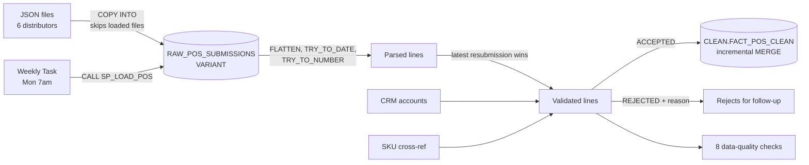
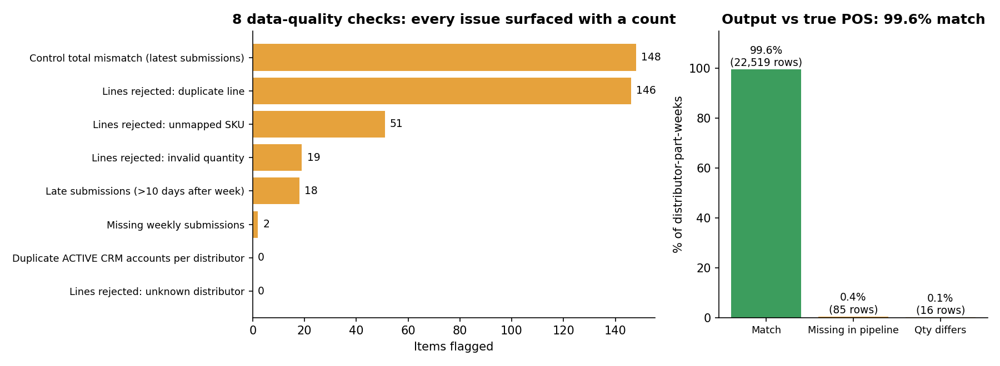

# Project 6: Multi-Source Distributor POS Ingestion Pipeline

**Snowflake (JSON, FLATTEN, MERGE, stored procedures, Tasks) · SQL · Python**

## Business problem
Six distributors send weekly point-of-sale (sell-through) files in **their own formats**: their own SKU codes, different date formats, corrected resubmissions, duplicates, and bad values. Reporting needs **one clean, trusted sales table**, refreshed automatically, with every problem surfaced for follow-up.

## Sources
| Source | Format | Challenges |
|---|---|---|
| Distributor POS submissions | JSON: 64 files, 796 submissions, 46K lines | Nested lines, 2 date formats, lowercase/padded SKUs, resubmissions, duplicates, "N/A" quantities |
| CRM accounts | CSV (Salesforce-style) | Inactive duplicate account for one distributor |
| SKU cross-reference | CSV | One distributor changed its SKU format mid-year |

## Pipeline

1. **Stage and load:** JSON lands in a VARIANT table with file name and load time; COPY skips files already loaded.
2. **Parse:** `LATERAL FLATTEN` to lines; two date formats; `TRY_TO_NUMBER` so bad quantities become NULL instead of failing the load; `UPPER(TRIM())` on codes.
3. **Resolve resubmissions:** latest submission per distributor-week wins.
4. **Validate:** every line gets one status: ACCEPTED, SUPERSEDED, or REJECTED with a reason.
5. **Load:** incremental `MERGE` into `CLEAN.FACT_POS_CLEAN`; re-runs are idempotent.
6. **Check:** 8 data-quality checks (control totals, missing and late submissions, rejects, CRM duplicates).
7. **Automate:** stored procedure + weekly Snowflake Task + run log.

## Results

- **45,008 lines accepted**, 1,037 superseded by corrected resubmissions, **216 rejected with reasons** (146 duplicates, 51 unmapped SKUs, 19 invalid quantities).
- Output matches the true sales on **99.6% of distributor-part-weeks** (22,519 of 22,620), and **every remaining gap is explained** by a data-quality finding:
  - 2 weekly files never received (Alpine Parts Group, May 2026)
  - Northstar changed the SKU format for 2 parts in Apr-2026 (added "-TR"), which would have silently removed those sales from reporting
  - 19 quantities sent as "N/A"
- A second run merges **0 rows** (idempotent).

## Business message
Sales data is now trustworthy, and here is the exact follow-up list: two missing files to request, two SKUs to add to the cross-reference, and corrupted lines to resend.

## Files
| File | What it does |
|---|---|
| [`01_stage_and_load.sql`](01_stage_and_load.sql) | File format, stage, landing table, COPY, reference tables |
| [`02_parse_and_validate.sql`](02_parse_and_validate.sql) | Header and line parsing, resubmission handling, validation, rejects |
| [`03_dq_checks.sql`](03_dq_checks.sql) | Control totals, missing/late submissions, check scorecard |
| [`04_load_clean_and_automate.sql`](04_load_clean_and_automate.sql) | MERGE procedure, run log, weekly Task, reconciliation to true sales |
| [`pipeline_local.py`](pipeline_local.py) | The same pipeline in Python (pandas) for local testing |
| [`pos_pipeline_dq_report.xlsx`](pos_pipeline_dq_report.xlsx) | Output: DQ checks, reconciliation, rejected lines, missing/late submissions |
| [`fact_pos_clean.csv`](fact_pos_clean.csv) | Output: the clean sales table |

## How to run
- **Snowflake:** run `01` → `04` in order (upload the files from `data/sources/` where the script says).
- **Local:** `python pipeline_local.py`
